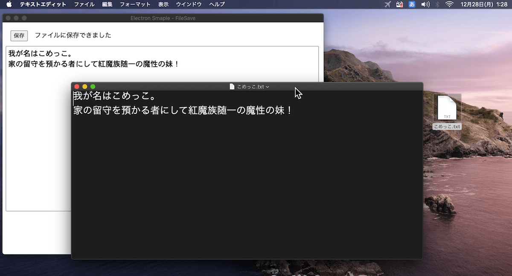

# Electron Sample - file save
「保存」ボタンをクリックするとダイアログが開き、テキストエリアの内容が指定したファイルに保存されます。



## 解説ページ
* [[Electron] ダイアログで指定したファイルに保存する](https://blog.katsubemakito.net/nodejs/electron/savefile-opendialog)

## 準備
Gitでリポジトリを取得します。
```shellsession
$ git clone https://github.com/katsube/electron-sample-file2.git
```

Node.jsがインストールされている環境で以下のコマンドを実行し、必要なライブラリを取得します。
```shellsession
$ cd electron-sample-file2
$ npm install
```

## 実行方法
以下でプレビューを行います。
```shellsession
$ npm start
```

ビルドは以下の通り。各OS用のインストーラーが作成されます。
```shellsession
$ npm run build-win
$ npm run build-mac
```
